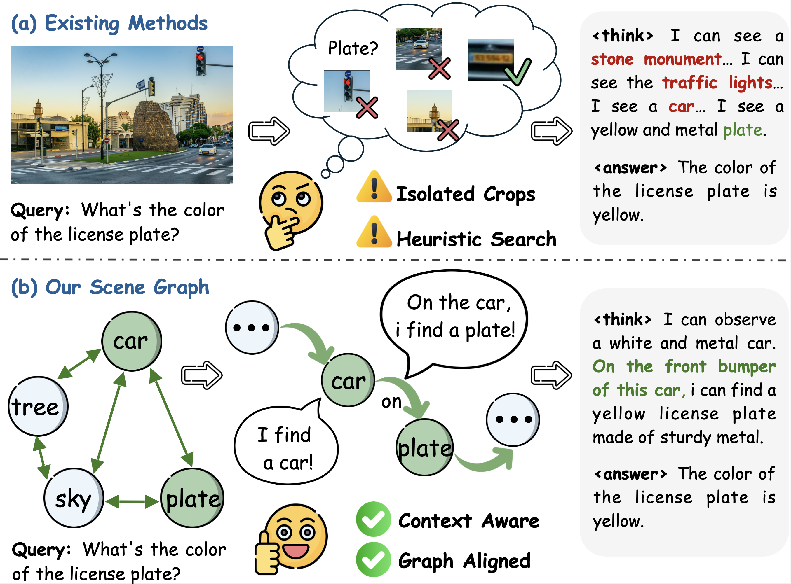
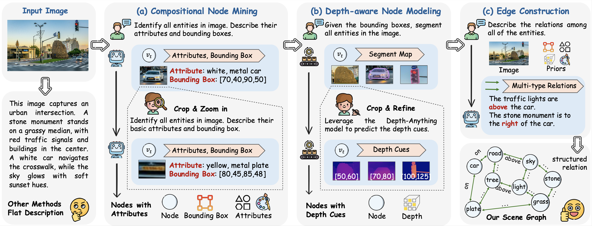
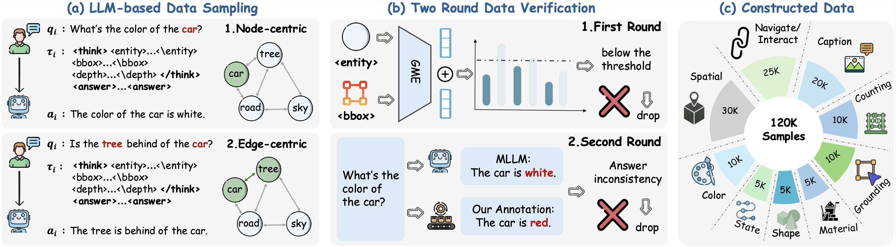

# Scene Graph Thinking: Reinforcing Structured Visual Reasoning for Multimodal Large Language Models (ICML 2026)

<div align="center">
  Zhiwei Yang<sup>1</sup>,
  Yuchen Wu<sup>1</sup>,
  Nan Zhang<sup>1</sup>,
  Yuxcong Meng<sup>2</sup>,
  Ke Yan<sup>1</sup>,
  Shouhong Ding<sup>1</sup>,
</div>

<p align="center">
<i>
1. Tencent Youtu Lab, Shanghai &nbsp;<br> 
2. Fudan University, Shanghai &nbsp;<br>
</i>
</p>

<p align="center">
📃 <a href="https://arxiv.org/pdf/2607.05716" target="_blank">Paper</a> | 
🤗 <a href="https://huggingface.co/collections/inclusionAI/zooming-without-zooming">Models & Training Datasets</a> 
</p>

## 📰 News

- **Jan. 30, 2026:** SaGe was submitted.
- **May 1, 2026:** 🎉 DiCLIP was accepted to **ICML 2026**.

🚧 **The code and datasets are currently under internal review due to company policy and will be released once the review process is complete. Thank you for your patience! 🤗**


## ✨ Introduction

<div align=center>

</div>

## 🚀 Overview

Recent MLLMs adopt a **Think-with-Image** paradigm to iteratively revisit visual evidence during reasoning. However, existing approaches primarily focus on isolated objects while overlooking structured visual relationships, limiting efficient target navigation and complex visual reasoning. We introduce **SaGe** (3B/7B), a structured visual reasoning framework that explicitly models scene graphs throughout the reasoning process. By leveraging automatically constructed graph reasoning data and graph-aligned post-training, SaGe achieves **state-of-the-art performance among open-source MLLMs on multimodal perception benchmarks**. Our highlights are as follow:

- **📊 Automated Graph Data Engine:** A scalable pipeline that transforms image-text pairs into high-quality scene-graph reasoning data with minimal human annotation.
- **🧠 Graph-Aligned Post-Training:** A two-stage training framework combining supervised fine-tuning with graph-aware reinforcement learning for hierarchical graph reasoning.
- **🏆 State-of-the-Art Performance:** Consistently outperforms existing open-source MLLMs across eight multimodal benchmarks, demonstrating superior perception, reasoning, and generalization.

## 🏗️ Method

### Hierarchical Scene Graph Construction

- **Compositional Node Mining:** Recursively decomposes objects into hierarchical components to construct fine-grained scene graph nodes.
- **Depth-aware Node Modeling:** Integrates explicit depth cues into graph nodes for geometry-aware visual reasoning.
- **Relation Construction:** Builds semantic and spatial graph edges from node-level priors.

<div align=center>

</div>

### Node-as-Proxy Reinforcement Learning

- **Node-grounded Reward:** Encourages reasoning trajectories that are grounded in the corresponding visual regions.
- **Node-relevance Reward:** Promotes efficient graph exploration through query-aware rewards over scene graph nodes.

<div align=center>

</div>


## 🎯 Models and Datasets

### Models

| Model | Base |  Download |
|-------|------|----------|
| SaGe-3B | Qwen2.5-VL-3B  | 🤗 [zwyang6/SaGe-3B](https://huggingface.co/zwyang6/SaGe) |
| SaGe-7B | Qwen2.5-VL-7B  | 🤗 [zwyang6/SaGe-7B](https://huggingface.co/zwyang6/SaGe) |
| SaGe-4B |  Qwen3-VL-4B  | 🤗 [zwyang6/SaGe-4B](https://huggingface.co/zwyang6/SaGe) |
---

### Training Datasets

Our scene-graph-aligned training data (120K samples): 🤗 [zwyang6/SaGe-SFT-VQA]()

Source image pools:
- SA-1B, LAION, MetaCLIP, Visual Genome, CC12M, STPLS3D (we just take a small part of images from each image pool; most of high resolution images are from train-0000-of-0013.parquet in https://modelscope.cn/datasets/Tongyi-DataEngine/SA1B-Paired-Captions-Images)

---


## 🛠️ Installation

```bash
git clone https://github.com/zwyang66/SaGe.git
cd Zooming-without-Zooming
pip install -r requirements.txt
cd verl
pip install -e . # please refer to the official repo of SAM3 for detailed installation
cd ../ms-swift
pip install -e . # please refer to the official repo of EasyR1 for detailed installation
```

## 🔥 Let's Start

> **The code and datasets are currently being organized and are under internal review. They will be released soon. Please stay tuned!**

## 🙏 Acknowledgments

This project builds upon:
- [Qwen2.5-VL](https://huggingface.co/collections/Qwen/qwen25-vl) and [Qwen3-VL](https://huggingface.co/collections/Qwen/qwen3-vl) for base models
- [ms-swift](https://github.com/modelscope/ms-swift.git) for SFT training framework
- [verl](https://github.com/verl-project/verl.git) for RL training framework

## 📮 Contact

For questions or collaborations, please contact:
- Zhiwei Yang: zwyang621@m.fudan.edu.cn

Please note that the code may contain minor bugs related to dataset paths. We appreciate any feedback or contributions. Thank you for your understanding and support!

## 📄 Citation

```bibtex
@inproceedings{yangscene,
  title={Scene Graph Thinking: Reinforcing Structured Visual Reasoning for Multimodal Large Language Models},
  author={Yang, Zhiwei and Wu, Yuanchen and Zhang, Nan and Meng, Yucong and Yan, Ke and Ding, Shouhong},
  booktitle={Forty-third International Conference on Machine Learning}
}
```
